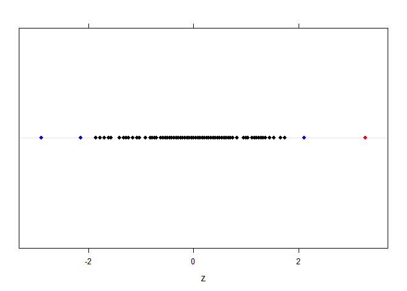
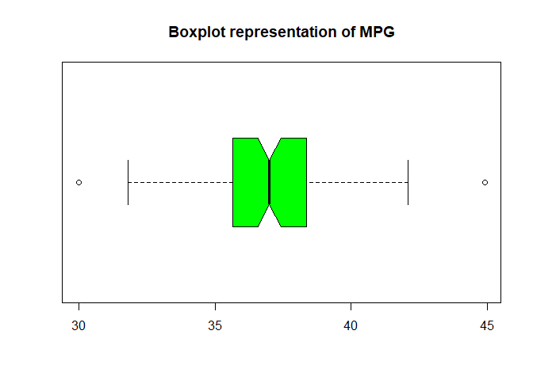

# Task 1

```r
getwd()
```

```
## [1] "C:/Users/obi4m/OneDrive/Desktop/LAB2"
```

# Task 2


```r
mpg.obj = read.csv("EPAGAS.csv")
head(mpg.obj)
```

```
##    MPG
## 1 36.3
## 2 41.0
## 3 36.9
## 4 37.1
## 5 44.9
## 6 36.8
```

# Task 3 

## 

```r
mpg = mpg.obj$MPG
z = (mpg-mean(mpg))/sd(mpg)
mean(z)
```

```
## [1] 1.058709e-16
```

```r
sd(z)
```

```
## [1] 1
```

## 

>
  The values of mpg that are possible outliers are:
  

```r
mpg[abs(z)>=2 & abs(z)<=3] 
```

```
## [1] 30.0 42.1 31.8
```

## 

> 
  The values of mpg that are defined as outliers are:
  

```r
mpg[abs(z)>3]
```

```
## [1] 44.9
```
  
##


```r
dplot = ifelse(abs(z)>3, "Red",
        ifelse(abs(z)>=2 &abs(z)<=3,"Blue", "Black"))
library(lattice)
dotplot(z,col=dplot)
```

<!-- -->

# Task 4


```r
boxplot(mpg,col="Green",data=mpg.obj, notch=TRUE, horizontal = TRUE)
title("Boxplot representation of MPG")
```

<!-- -->

##

>
  Using Chebyshev's theorem the proportion of data within 2 standard deviations of the mean of the mpg data is 75%.


```r
k = 2; 
(1-1/(k)^2) 
```

```
## [1] 0.75
```

##

>
  Using R the exact, proportion within 2 standard deviation of the mean is 96%.
  

```r
length(z[abs(z)<2])/length(z)
```

```
## [1] 0.96
```

##
>
  No
  
##
>
  Using Empirical rule, approximately 95% of the data should be within 2 standard deviations of the mean.
  
##
>
  It corresponds
  
##
>
  Yes the Empirical rule is valid in this case because the data has a normal distribution.
