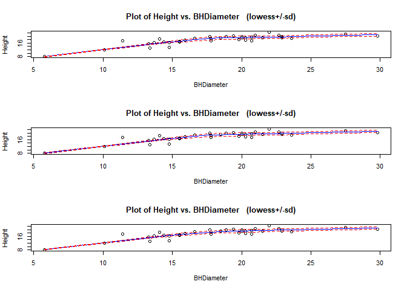
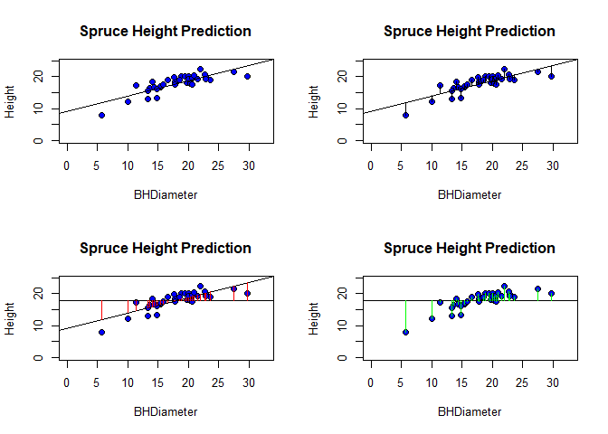

# Task 1 

```r
getwd()
```

```
## [1] "C:/Users/obi4m/OneDrive/Desktop/LAB3"
```

# Task 2

```r
spruce.df = read.table(file.choose(), header = TRUE, sep =',')
head(spruce.df)
```

```
##   BHDiameter Height
## 1       18.9   20.0
## 2       16.6   18.8
## 3       15.5   16.8
## 4       15.5   16.9
## 5       19.4   20.2
## 6       13.7   16.3
```

# Task 3

##

```r
windows()
plot(Height~BHDiameter,pch = 21, bg= "Blue",ylim = c(0,1.1*max(Height)),xlim = c(0,1.1*max(BHDiameter)),  cex = 1.2, data = spruce.df)
title(main="Spruce Height Prediction")
```

<!-- -->

## 
 
 > 
  No 
  
##


```r
library(s20x)
windows()
layout(matrix(1:3, nr = 3, nc = 1, byrow = TRUE))
layout.show(3)
```

<!-- -->

```r
trendscatter(Height~BHDiameter, f =0.5, data = spruce.df )
trendscatter(Height~BHDiameter, f =0.6, data = spruce.df )
trendscatter(Height~BHDiameter, f =0.7, data = spruce.df )
```

<!-- -->

##

```r
spruce.lm = with(spruce.df, lm(Height~BHDiameter))
windows()
plot(Height~BHDiameter,pch = 21, bg= "Blue",ylim = c(0,1.1*max(Height)),xlim = c(0,1.1*max(BHDiameter)),  cex = 1.2, data = spruce.df)
title(main="Spruce Height Prediction")
abline(spruce.lm)
```

<!-- -->

##
>
  I don't think the straight line is appropriate

# Task 4

```r
windows()
layout(matrix(1:4,nr = 2,nc =2, byrow = TRUE))
layout.show(4)
```

<!-- -->

```r
  # Plot 1
plot(Height~BHDiameter,pch = 21, bg= "Blue",ylim = c(0,1.1*max(Height)),xlim = c(0,1.1*max(BHDiameter)),  cex = 1.2, data = spruce.df)
title(main="Spruce Height Prediction")
spruce.lm = with(spruce.df, lm(Height~BHDiameter))
abline(spruce.lm)
  # Plot 2
plot(Height~BHDiameter,pch = 21, bg= "Blue",ylim = c(0,1.1*max(Height)),xlim = c(0,1.1*max(BHDiameter)),  cex = 1.2, data = spruce.df)
title(main="Spruce Height Prediction")
yhat=fitted(spruce.lm) # gives the ycoord of the fitted line
with(spruce.df,{segments(BHDiameter,Height,BHDiameter,yhat)})
abline(spruce.lm)
RSS = with(spruce.df, sum((Height-yhat)^2))
  # Plot 3
plot(Height~BHDiameter,pch = 21, bg= "Blue",ylim = c(0,1.1*max(Height)),xlim = c(0,1.1*max(BHDiameter)),  cex = 1.2, data = spruce.df)
title(main="Spruce Height Prediction")
with(spruce.df, abline(h=mean(Height)))
abline(spruce.lm)
with(spruce.df, {segments(BHDiameter, mean(Height), BHDiameter, yhat, col = "Red")})
MSS = with(spruce.df,sum((yhat-mean(Height))^2))  
# Plot #4
plot(Height~BHDiameter,pch = 21, bg= "Blue",ylim = c(0,1.1*max(Height)),xlim = c(0,1.1*max(BHDiameter)),  cex = 1.2, data = spruce.df)
title(main="Spruce Height Prediction")
with(spruce.df,abline(h=mean(Height)))
with(spruce.df,{segments(BHDiameter, Height,BHDiameter,mean(Height), col = "Green")})
```

<!-- -->

```r
TSS = with(spruce.df, sum((Height-mean(Height))^2))  
TSS
```

```
## [1] 278.9475
```

```r
RSS
```

```
## [1] 95.70281
```

```r
MSS
```

```
## [1] 183.2447
```

```r
MSS/TSS
```

```
## [1] 0.6569146
```

```r
MSS+RSS
```

```
## [1] 278.9475
```

#TASK 5

##


```r
summary(spruce.lm)
```

```
## 
## Call:
## lm(formula = Height ~ BHDiameter)
## 
## Residuals:
##     Min      1Q  Median      3Q     Max 
## -3.9394 -0.9763  0.2829  0.9950  2.6644 
## 
## Coefficients:
##             Estimate Std. Error t value Pr(>|t|)    
## (Intercept)  9.14684    1.12131   8.157 1.63e-09 ***
## BHDiameter   0.48147    0.05967   8.069 2.09e-09 ***
## ---
## Signif. codes:  0 '***' 0.001 '**' 0.01 '*' 0.05 '.' 0.1 ' ' 1
## 
## Residual standard error: 1.678 on 34 degrees of freedom
## Multiple R-squared:  0.6569,	Adjusted R-squared:  0.6468 
## F-statistic:  65.1 on 1 and 34 DF,  p-value: 2.089e-09
```

##
>
  slope = 0.48147
  
## 
>
 Intercept = 9.14684

## 
>
  Height = 9.14684 + 0.48147*BHDiameter
  
## 

```r
predict(spruce.lm, data.frame(BHDiameter = c(15,18, 20)))
```

```
##        1        2        3 
## 16.36895 17.81338 18.77632
```

#Task 6

```r
library(ggplot2)
g = ggplot(spruce.df, aes(x = BHDiameter, y = Height, colour = BHDiameter))
g = g+geom_point()+ geom_line()+geom_smooth(method="lm")
g +ggtitle("Height vs BHDiameter")
```

<!-- -->

