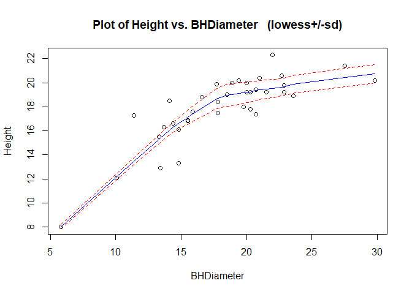
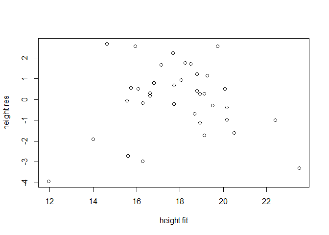
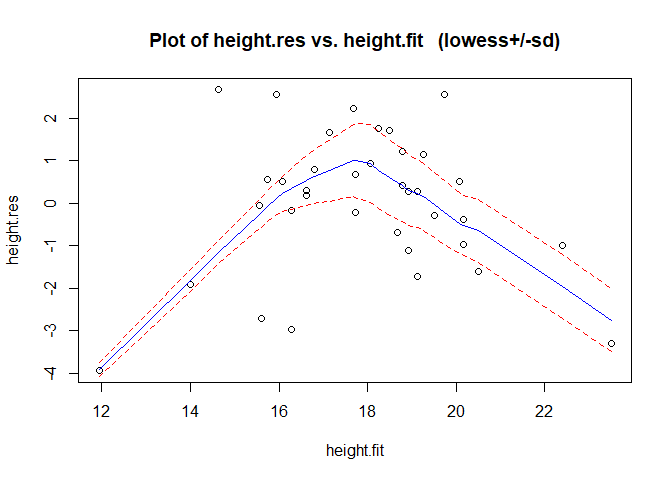
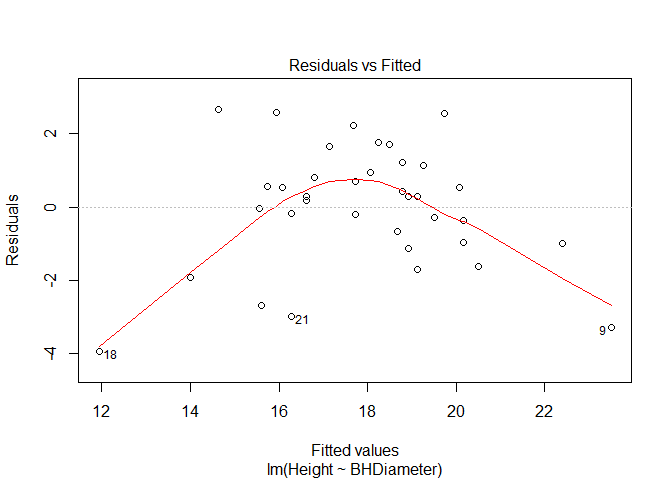
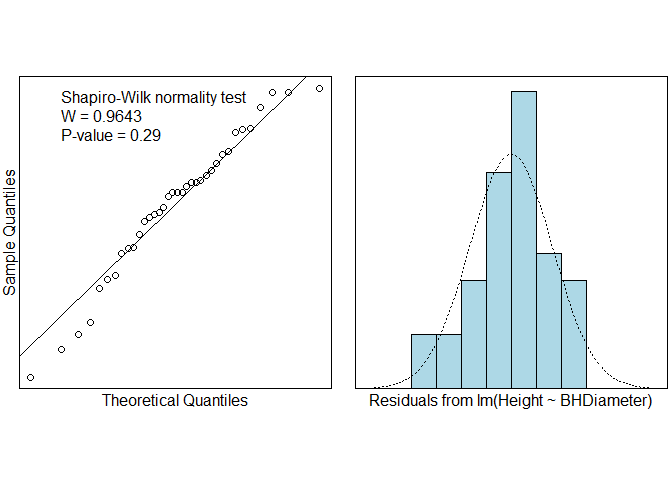
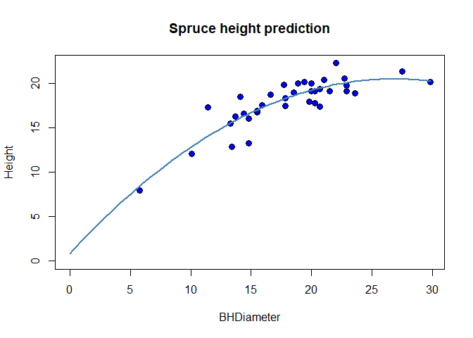
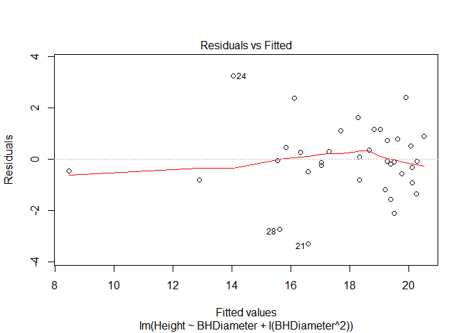
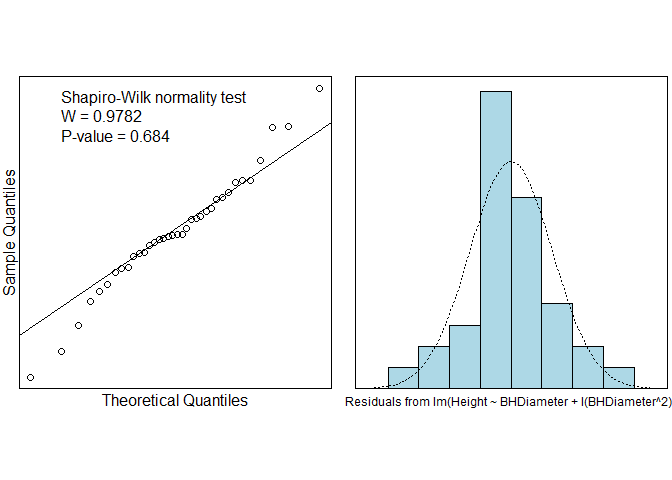
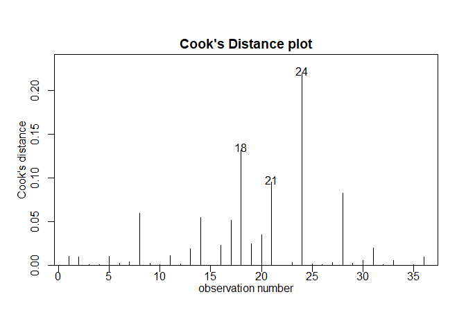

#Task 1

```r
getwd()
```

```
## [1] "C:/Users/obi4m/OneDrive/Desktop/LAB4"
```

#Task 2

```r
# read in SPRUCE.csv data file
spruce.df = read.csv("SPRUCE.csv")
# display last six lines
tail(spruce.df)
```

```
##    BHDiameter Height
## 31       17.7   19.9
## 32       20.7   19.4
## 33       21.0   20.4
## 34       13.3   15.5
## 35       15.9   17.6
## 36       22.9   19.2
```

#Task 3

##A 

```r
library(s20x)
trendscatter(Height~BHDiameter,f=0.5,data=spruce.df)
```

<!-- -->

##B

```r
# make linear model  of spruce data
spruce.lm=lm(Height~BHDiameter,data=spruce.df)
summary(spruce.lm)
```

```
## 
## Call:
## lm(formula = Height ~ BHDiameter, data = spruce.df)
## 
## Residuals:
##     Min      1Q  Median      3Q     Max 
## -3.9394 -0.9763  0.2829  0.9950  2.6644 
## 
## Coefficients:
##             Estimate Std. Error t value Pr(>|t|)    
## (Intercept)  9.14684    1.12131   8.157 1.63e-09 ***
## BHDiameter   0.48147    0.05967   8.069 2.09e-09 ***
## ---
## Signif. codes:  0 '***' 0.001 '**' 0.01 '*' 0.05 '.' 0.1 ' ' 1
## 
## Residual standard error: 1.678 on 34 degrees of freedom
## Multiple R-squared:  0.6569,	Adjusted R-squared:  0.6468 
## F-statistic:  65.1 on 1 and 34 DF,  p-value: 2.089e-09
```

##C

```r
#residuals  created from the linear model object
height.res=residuals(spruce.lm)
#fitted values made from the linear model object
height.fit=fitted(spruce.lm)
# make linear model  of spruce data
plot(height.fit,height.res)
```

<!-- -->

```r
# Put a lowess smoother through res vs fitted
trendscatter( height.fit,height.res)
```

<!-- -->

##D

>
  What shape is seen in the plot? Compare it with the curve made with the trendscatter function (second line after Task3).

>
  We can see clear elements of the original signal in the residual plot. This implies that the model has not all the points in the original data set.

##E


```r
# Make quick plot of residuals
windows()
plot(spruce.lm, which =1)
```

<!-- -->

##F

>
	Check normality using the s20x function normcheck(). Please note that you may need to add an additional option to show the Shapiro-Wilk test (use ?normcheck )
	

```r
# Two plots testing normality
windows()
normcheck(spruce.lm,shapiro.wilk = TRUE)
```

<!-- -->

##G

>
  What is the pvalue for the Shapiro-Wilk test? What is the NULL hypothesis in this case?

>  
  The P-value is 0.29. This implies that there is no significant evidence against the null.
  
##H

>
  	y_i=??_0+??_1 x_i+??_(i,)  ??_i???N(0,??^2) describes the model used above. Notice that the residuals r_i estimate the model errors ??_i. If the model works well with the data we should expect that the residuals are approximately Normal in distribution with mean 0 and constant variance.??? = ???0 + ???1?????? 

##I

>
	Write a sentence outlining your conclusions concerning the validity of applying the straight line to this data set.
	
>
Even though the straight line model passes the normality check, it fails the first assumption to having a trend conforming to the trend in the data.

#Task 4

## A


```r
## Quadratic object using the linear model
quad.lm=lm(Height~BHDiameter + I(BHDiameter^2),data=spruce.df)
windows()
```
##B

```r
# plot spruce data set
plot(Height~BHDiameter,bg="Blue",pch=21,cex=1.2,
     ylim=c(0,max(Height)),xlim=c(0,max(BHDiameter)), 
     main="Spruce height prediction",data=spruce.df)
myplot=function(x){
  quad.lm$coef[1] +quad.lm$coef[2]*x  + quad.lm$coef[3]*x^2
} 
# add quadratic line
curve(myplot, lwd=2, col="steelblue",add=TRUE)
```

<!-- -->

##C

```r
#fitted values made from the quadratic model object
quad.fit=fitted(quad.lm)
quad.res = residuals(quad.lm)
windows()
plot(quad.lm, which = 1)
```

<!-- -->

##D

```r
# norm check
normcheck(quad.lm, shapiro.wilk = TRUE)
```

<!-- -->

#Task 5

##A

```r
# summarize quadratic model
summary(quad.lm)
```

```
## 
## Call:
## lm(formula = Height ~ BHDiameter + I(BHDiameter^2), data = spruce.df)
## 
## Residuals:
##     Min      1Q  Median      3Q     Max 
## -3.2966 -0.6245 -0.0707  0.7442  3.2541 
## 
## Coefficients:
##                  Estimate Std. Error t value Pr(>|t|)    
## (Intercept)      0.860896   2.205022   0.390 0.698731    
## BHDiameter       1.469592   0.243786   6.028 8.88e-07 ***
## I(BHDiameter^2) -0.027457   0.006635  -4.138 0.000227 ***
## ---
## Signif. codes:  0 '***' 0.001 '**' 0.01 '*' 0.05 '.' 0.1 ' ' 1
## 
## Residual standard error: 1.382 on 33 degrees of freedom
## Multiple R-squared:  0.7741,	Adjusted R-squared:  0.7604 
## F-statistic: 56.55 on 2 and 33 DF,  p-value: 2.182e-11
```

##B

>
  0.860896
 
##C

>
  1.469592
  
##D

>
  -0.027457

##E


```r
# Estimate intervals for coefficents
ciReg(quad.lm)
```

```
##                 95 % C.I.lower    95 % C.I.upper
## (Intercept)           -3.62525           5.34705
## BHDiameter             0.97361           1.96558
## I(BHDiameter^2)       -0.04096          -0.01396
```

##F
>
  Height = 0.860896 + 1.469592 X BHDiameter - 0.027457 X BHDiameter^2
  
##G

```r
# Predict Height of Spruce given BHDiameter of 15,18, 20
predict(quad.lm, data.frame(BHDiameter = c(15,18,20)))
```

```
##        1        2        3 
## 16.72690 18.41740 19.26984
```

##H

```r
predict(spruce.lm, data.frame(BHDiameter = c(15,18,20)))
```

```
##        1        2        3 
## 16.36895 17.81338 18.77632
```

##I
>
  	What is the value of multiple R^2? Compare it with the previous model. 
  	
> It is 0.7741 for quad.lm. Comparing to 0.6569 for the linear model, this proves further that quadratic model is a better fit.

##J

>
  Make use of adjusted R squared to compare models to determine which is "better". Use the web to learn about adjusted R squared.
  
>
  The adjusted R squared is 0.6468 for the linear model and 0.7604 for the quadratic model. Since adjusted R squared increases as terms improve the model more than expected by chance and decreases for improvements less than expected by chance. We can say that the quadratic model is a better fit.
  
## K

>
	What does ( multiple R^2) mean in this case?
	
>
	It is the fraction or percentage of the variability in Height that is explained by the model.
	
## L

>
  Which model explains the most variability in the Height?

>
  The quadratic model
  
## M

>
	Use anova() and compare the two models. Paste anova output here and give your conclusion underneath.
	

```r
anova(spruce.lm,quad.lm)
```

```
## Analysis of Variance Table
## 
## Model 1: Height ~ BHDiameter
## Model 2: Height ~ BHDiameter + I(BHDiameter^2)
##   Res.Df    RSS Df Sum of Sq      F    Pr(>F)    
## 1     34 95.703                                  
## 2     33 63.007  1    32.696 17.125 0.0002269 ***
## ---
## Signif. codes:  0 '***' 0.001 '**' 0.01 '*' 0.05 '.' 0.1 ' ' 1
```

>
  It can be seen that the RSS for the quadratic model is less than that of the linear model.
With all the information, on both models, it is fair to say that the quadratic model is abetter model.


##N 

```r
# Calculate RSS, TSS and MSS
height.qfit=fitted(quad.lm)

RSS=with(spruce.df, sum((Height-height.qfit)^2))
RSS
```

```
## [1] 63.00683
```

##O

```r
MSS = with(spruce.df, sum((height.qfit-mean(Height))^2))
MSS
```

```
## [1] 215.9407
```

##P

```r
TSS = with(spruce.df, sum((Height-mean(Height))^2))
TSS
```

```
## [1] 278.9475
```

##Q

```r
MSS/TSS
```

```
## [1] 0.7741266
```

#Task 6

##A

```r
# Investigate unsual points
cooks20x(quad.lm)
```

<!-- -->

##B
>
	Use the web to find out what cooks distance is and how it is used - write a couple of sentences here.
	
>
For a given data set, points with large residuals can distort regression analysis.
Cook's distance measures the effect of deleting a given observation. Points with large cooks distance thus merit closer examination.

##C
>
	What does cooks distance for the quadratic model and data tell you?

>
  The Cooks distance shows that the 24th, 18th, and 21st observations are the three most deviated from the mean of the data set.
  
##D

```r
quad2.lm=lm(Height~BHDiameter + I(BHDiameter^2) , data=spruce.df[-24,])
#Summary of the new object
summary(quad2.lm)
```

```
## 
## Call:
## lm(formula = Height ~ BHDiameter + I(BHDiameter^2), data = spruce.df[-24, 
##     ])
## 
## Residuals:
##      Min       1Q   Median       3Q      Max 
## -3.11233 -0.48227  0.01253  0.71727  2.59146 
## 
## Coefficients:
##                  Estimate Std. Error t value Pr(>|t|)    
## (Intercept)     -0.341500   2.068479  -0.165     0.87    
## BHDiameter       1.564793   0.226102   6.921 7.78e-08 ***
## I(BHDiameter^2) -0.029242   0.006114  -4.782 3.74e-05 ***
## ---
## Signif. codes:  0 '***' 0.001 '**' 0.01 '*' 0.05 '.' 0.1 ' ' 1
## 
## Residual standard error: 1.266 on 32 degrees of freedom
## Multiple R-squared:  0.8159,	Adjusted R-squared:  0.8044 
## F-statistic: 70.91 on 2 and 32 DF,  p-value: 1.74e-12
```

##E


```r
#Compare with the summary information from quad.lm
#Summary of the intial object
summary(quad.lm)
```

```
## 
## Call:
## lm(formula = Height ~ BHDiameter + I(BHDiameter^2), data = spruce.df)
## 
## Residuals:
##     Min      1Q  Median      3Q     Max 
## -3.2966 -0.6245 -0.0707  0.7442  3.2541 
## 
## Coefficients:
##                  Estimate Std. Error t value Pr(>|t|)    
## (Intercept)      0.860896   2.205022   0.390 0.698731    
## BHDiameter       1.469592   0.243786   6.028 8.88e-07 ***
## I(BHDiameter^2) -0.027457   0.006635  -4.138 0.000227 ***
## ---
## Signif. codes:  0 '***' 0.001 '**' 0.01 '*' 0.05 '.' 0.1 ' ' 1
## 
## Residual standard error: 1.382 on 33 degrees of freedom
## Multiple R-squared:  0.7741,	Adjusted R-squared:  0.7604 
## F-statistic: 56.55 on 2 and 33 DF,  p-value: 2.182e-11
```

>
  I can observe an improvement in the Mulitiple r-squared and Adjusted R-squared values from 0.7741 and 0. 7604 respectively for the quad.lm model to 0.8159 and 0.8044 for the model with highest cooks distance removed.

##G
>
  What do you conclude?

>
  Removing the Highest Cook's Distance in the model improved the models fit.
  
