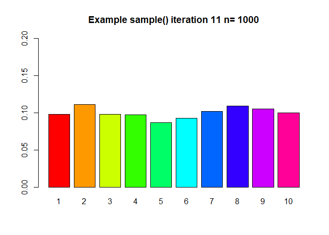
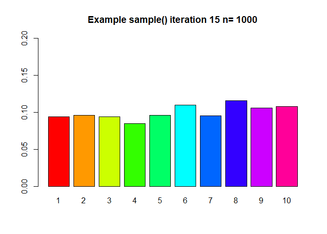

#Task 1

```r
getwd()
```

```
## [1] "C:/Users/obi4m/OneDrive/Desktop/LAB5"
```

#Task 2

##A


```r
## sampling function
# iter = iterations, n=sample size
# set default values
mybin=function(iter=100,n=10, p=0.5){ 
  # make a matrix to hold the samples
  #initially filled with NA's
  sam.mat=matrix(NA,nr=n,nc=iter, byrow=TRUE)
  #Make a vector to hold the number of successes in each trial
  succ=c()
  for( i in 1:iter){
    #Fill each column with a new sample
    sam.mat[,i]=sample(c(1,0),n,replace=TRUE, prob=c(p,1-p))
    #Calculate a statistic from the sample (this case it is the sum)
    succ[i]=sum(sam.mat[,i])
  }
  #Make a table of successes
  succ.tab=table(factor(succ,levels=0:n))
  #Make a barplot of the proportions
  barplot(succ.tab/(iter), col=rainbow(n+1), main="Binomial simulation", xlab="Number of successes")
  succ.tab/iter
}
```

### Ai)
>
 100 iteration
 

```r
windows()
mybin(iter=100,n=10, p=0.7)
```

<!-- -->

```
## 
##    0    1    2    3    4    5    6    7    8    9   10 
## 0.00 0.00 0.01 0.01 0.03 0.10 0.19 0.31 0.29 0.04 0.02
```

### Aii)
>
  200 iteration


```r
# 200 iterations
mybin(iter=200,n=10, p=0.7)
```

<!-- -->

```
## 
##     0     1     2     3     4     5     6     7     8     9    10 
## 0.000 0.000 0.000 0.005 0.025 0.110 0.205 0.250 0.265 0.130 0.010
```

### Aiii)
>
  500 iteration
  

```r
# 500 iterations
mybin(iter=500,n=10, p=0.7)
```

<!-- -->

```
## 
##     0     1     2     3     4     5     6     7     8     9    10 
## 0.000 0.000 0.002 0.016 0.034 0.080 0.184 0.274 0.274 0.096 0.040
```

### Aiv)
>
  1000 iteration
  

```r
# 1000 iterations
mybin(iter=1000,n=10, p=0.7)
```

<!-- -->

```
## 
##     0     1     2     3     4     5     6     7     8     9    10 
## 0.000 0.001 0.001 0.006 0.041 0.119 0.176 0.268 0.236 0.125 0.027
```
  
### Av) and B
>
  10000 iteration
  

```r
# 10000 iterations
# 
mybin(iter=10000,n=10, p=0.7)
```

<!-- -->

```
## 
##      0      1      2      3      4      5      6      7      8      9 
## 0.0000 0.0001 0.0016 0.0099 0.0349 0.1013 0.1955 0.2696 0.2384 0.1197 
##     10 
## 0.0290
```

## C

```r
# creating binomial distribution using dbinom
obj = dbinom(1:10,size = 10,prob = 0.7)
round(obj,4)
```

```
##  [1] 0.0001 0.0014 0.0090 0.0368 0.1029 0.2001 0.2668 0.2335 0.1211 0.0282
```

#TASK 3

## A


```r
# sample of 5 marbles from a set of 12 white (1's) and 8 black (0's) marbles
M = c(rep(1,12),rep(0,8));
M
```

```
##  [1] 1 1 1 1 1 1 1 1 1 1 1 1 0 0 0 0 0 0 0 0
```

```r
# Without replacement
sample(M, size = 5,replace = FALSE)
```

```
## [1] 1 0 0 1 0
```

## B

```r
# With replacement
sample(c(1,0), size = 5, prob = c(12/20,8/20), replace = TRUE)
```

```
## [1] 1 0 1 1 0
```

## C and D

```r
# call myhyper function
source('lab5-hypergeometric.R')
```

<!-- -->

```r
myhyper(iter =100, n = 5, N = 20, r = 12) # for 100 iterations
```

<!-- -->

```
## 
##    0    1    2    3    4    5 
## 0.00 0.06 0.24 0.38 0.26 0.06
```

```r
myhyper(iter =200, n = 5, N = 20, r = 12) # for 200 iterations
```

<!-- -->

```
## 
##     0     1     2     3     4     5 
## 0.010 0.035 0.265 0.355 0.295 0.040
```

```r
myhyper(iter =500, n = 5, N = 20, r = 12) # for 500 iterations
```

<!-- -->

```
## 
##     0     1     2     3     4     5 
## 0.004 0.056 0.256 0.376 0.266 0.042
```

```r
myhyper(iter =1000, n = 5, N = 20, r = 12) # for 1000 iterations
```

<!-- -->

```
## 
##     0     1     2     3     4     5 
## 0.002 0.054 0.240 0.391 0.275 0.038
```

```r
myhyper(iter =10000, n = 5, N = 20, r = 12) # for 10000 iterations
```

<!-- -->

```
## 
##      0      1      2      3      4      5 
## 0.0035 0.0549 0.2414 0.3957 0.2538 0.0507
```

##E

```r
# Produce a hypergeometric distribution using dhyper
obj = dhyper(x = 0:5, m = 12, n = 8, k = 5)
round(obj,4)
```

```
## [1] 0.0036 0.0542 0.2384 0.3973 0.2554 0.0511
```

#TASK 4

## A
>
  In lab5.r there is a function called mysample(). Look at the code and describe what you think it should do - record your response here.

>
  The code generates n samples of 1:10 with replacement, converts the sampled vector in to a factor by assigning levels 1:10. Next a table is created with each member of the sampled set placed under its corresponding level. Finally, a barplot of the sampled set is created. This process is repeated for iter iterations. The last line of the code delays its execution for a time time.
  
## B


```r
mysample=function(n, iter=10,time=0.5){
  for( i in 1:iter){
    #make a sample
    s=sample(1:10,n,replace=TRUE)
    # turn the sample into a factor
    sf=factor(s,levels=1:10)
    #make a barplot
    barplot(table(sf)/n,beside=TRUE,col=rainbow(10), 
            main=paste("Example sample()", " iteration ", i, " n= ", n,sep="") ,
            ylim=c(0,0.2)
    )
    
    #release the table
    Sys.sleep(time)
  }
}

mysample(n = 1000,iter = 30,time = 1)
```

<!-- --><!-- --><!-- --><!-- --><!-- --><!-- --><!-- --><!-- --><!-- --><!-- --><!-- --><!-- --><!-- --><!-- --><!-- --><!-- --><!-- --><!-- --><!-- --><!-- --><!-- --><!-- --><!-- --><!-- --><!-- --><!-- --><!-- --><!-- --><!-- --><!-- -->

##C

>
  Describe what you see here.

>  
  I noticed that with every iteration the height of the plots keep changing mostly about the relative frequency 0.10.
  

#TASK 5


```r
# ways of choosing 4 out of 8
choose(8,4)
```

```
## [1] 70
```

```r
# probability that y >4
# q = vector of quantile =4
ppois(4,lambda = 2, lower.tail = FALSE)
```

```
## [1] 0.05265302
```

```r
# probability Y=10 ~ NegBin (p=0.4,r =3)
mynbin=function(y,r,p){
  choose(y-1,r-1)*p^r*(1-p)^(y-r)
}
mynbin(10,3,0.4)
```

```
## [1] 0.06449725
```

```r
# Calculate probability of 8S in a binomial with 15 samples 
pbinom(8,15,0.4)
```

```
## [1] 0.9049526
```

