#TASK 1

```r
getwd()
```

```
## [1] "C:/Users/obi4m/OneDrive/Desktop/maths/LAB9"
```

#TASK 2
## 
###  LINE A
Line A takes n*iter samples from the random variable x with replacement.

### Line B
Calculates the confidence interval of the statistic vector, stat. These are the values that fall between alpha/2 and 1-alpha/2

### Explain what you see (replace=TRUE)


```r
set.seed(35) # This will give everyone the same sample
sam=round(rnorm(20,mean=10,sd=4),2)
unique(sample(sam,20,replace=TRUE) ) # repeat this line 5Xs
```

```
##  [1]  2.89  8.00 13.46 11.40 12.05  8.62 11.64  7.75 23.35  2.37  6.93
## [12] 16.69
```

> 
  I noticed that each time I reran the last line, the number of samples generated changed from 12-14-14-15-11 samples. Also, all the samples are unique.

### Explain what you see
(replace=FALSE)

```r
unique(sample(sam,20,replace=FALSE) ) # repeat this line 5Xs
```

```
##  [1]  8.62 23.35  2.89 10.53  2.37 17.35 11.64 11.40  9.82 14.26  6.93
## [12] 16.69 14.76  8.43 13.46  9.86 11.78  8.00 12.05  7.75
```

>
  For this case, the number of samples generated remain the same for every run of the last line. Also, all the samples are unique.

### What happens and why?

```r
#unique(sample(sam,21,replace=FALSE) ) # repeat this line 5Xs
```

>
  R studio returns an error message.  This is because we cannot take 21 samples from a population of 20 without replacement.
 
#Task 3

##

```r
myboot2<-function(iter=10000,x,fun="mean",alpha=0.05,cx=1.5,...){  #Notice where the ... is repeated in the code
  n=length(x)   #sample size
  
  y=sample(x,n*iter,replace=TRUE)
  rs.mat=matrix(y,nr=n,nc=iter,byrow=TRUE)
  xstat=apply(rs.mat,2,fun) # xstat is a vector and will have iter values in it 
  ci=quantile(xstat,c(alpha/2,1-alpha/2))# Nice way to form a confidence interval
  # A histogram follows
  # The object para will contain the parameters used to make the histogram
  para=hist(xstat,freq=FALSE,las=1,
            main=paste("Histogram of Bootstrap sample statistics","\n","alpha=",alpha," iter=",iter,sep=""),
            ...)
  
  #mat will be a matrix that contains the data, this is done so that I can use apply()
  mat=matrix(x,nr=length(x),nc=1,byrow=TRUE)
  
  #pte is the point estimate
  #This uses whatever fun is
  pte=apply(mat,2,fun)
  abline(v=pte,lwd=3,col="Black")# Vertical line
  segments(ci[1],0,ci[2],0,lwd=4)      #Make the segment for the ci
  text(ci[1],0,paste("(",round(ci[1],2),sep=""),col="Red",cex=cx)
  text(ci[2],0,paste(round(ci[2],2),")",sep=""),col="Red",cex=cx)
  
  # plot the point estimate 1/2 way up the density
  text(pte,max(para$density)/2,round(pte,2),cex=cx)
  
  return(list(ci=ci,fun=fun,x=x))# Some output to use if necessary
}

################### END mybooot function #####################

# set.seed(39); sam=rnorm(25,mean=25,sd=10)
# myboot2(10000,x=sam,fun="mean",alpha=0.05,xlab="mean",col="Purple",cx=1.5)

# A
set.seed(39); sam=rnorm(25,mean=25,sd=10)
myboot2(10000,x=sam,fun="mean",alpha=0.05,xlab="mean",col="Purple",cx=1.5)
```

<!-- -->

```
## $ci
##     2.5%    97.5% 
## 21.31693 26.53540 
## 
## $fun
## [1] "mean"
## 
## $x
##  [1] 23.14434 12.70757 20.72797 19.04018 29.67324 29.21639 14.78348
##  [8] 18.77523 33.37002 34.61627 26.04230 24.40206 32.03731 17.45030
## [15] 19.54464 20.45388 23.83394 30.47815 25.79640 22.67536 10.27711
## [22] 26.77487 37.10044 21.59809 22.50625
```

```r
# B
set.seed(30); sam=rchisq(20,df=3)
myboot2(10000,x=sam,fun="mean",alpha=0.05,xlab="mean",col="Purple",cx=1.5)
```

<!-- -->

```
## $ci
##     2.5%    97.5% 
## 2.052178 3.862641 
## 
## $fun
## [1] "mean"
## 
## $x
##  [1] 0.2531032 1.6194423 5.3578133 7.3134789 0.1194100 5.0344239 5.8189991
##  [8] 4.3689673 1.6690814 3.2533362 0.9050305 2.5730754 1.9610329 2.9675027
## [15] 1.5722396 1.6959031 1.9261106 3.9198072 6.0919801 0.4082447
```

```r
# C
set.seed(40); sam=rgamma(30,shape=2,scale=3)
myboot2(10000,x=sam,fun="mean",alpha=0.05,xlab="mean",col="Purple",cx=1.5)
```

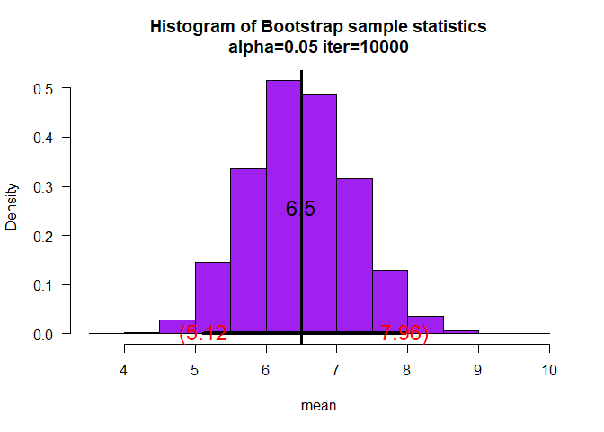<!-- -->

```
## $ci
##     2.5%    97.5% 
## 5.122351 7.959613 
## 
## $fun
## [1] "mean"
## 
## $x
##  [1]  6.4265012  6.5077401  1.8958495  5.3836641  1.4179366  0.7925928
##  [7]  8.0380097 14.7293204  5.2917468  2.7989621  7.9632983  2.8733832
## [13]  7.4419824  2.2828464  5.9877646 12.9354365  1.4996069  1.7478044
## [19] 12.3674161  8.4093535 10.2053201  8.0243948  6.5178039  7.9118846
## [25]  1.6924333 10.7938057  5.7341134 15.1533278  3.8545321  8.1861897
```

```r
# D
set.seed(10); sam=rbeta(20,shape1=3,shape2=4)
myboot2(10000,x=sam,fun="mean",alpha=0.05,xlab="mean",col="Purple",cx=1.5)
```

<!-- -->

```
## $ci
##      2.5%     97.5% 
## 0.3415605 0.4742732 
## 
## $fun
## [1] "mean"
## 
## $x
##  [1] 0.4325491 0.3899825 0.1714409 0.3068918 0.4920588 0.5129946 0.1974398
##  [8] 0.3533577 0.1343329 0.3751208 0.6722481 0.5946901 0.3788602 0.6467397
## [15] 0.5914547 0.4476104 0.2407876 0.3877302 0.5336340 0.3074436
```

##

```r
# means 
# for A, mean  =25
set.seed(39); sam=rnorm(25,mean=25,sd=10)
mean(sam)
```

```
## [1] 23.88103
```

```r
# for B, mean of a chi_squared is df =3
set.seed(30); sam=rchisq(20,df=3)
mean(sam)
```

```
## [1] 2.941449
```

```r
# C
set.seed(40); sam=rgamma(30,shape=2,scale=3)
mu_gamma = 2*3 # mean = shape * scale;
mu_gamma
```

```
## [1] 6
```

```r
# D
set.seed(10); sam=rbeta(20,shape1=3,shape2=4)
mu_beta = 3/(3+4)
mu_beta
```

```
## [1] 0.4285714
```

>
  A -the mean of the normal distribution is 23.. Therefore, the point estimate of  23.88 is very close (it is 0.112 sd's away from the population mean)
>
  B -  the mean of the chi-squared distributed population is the degrees of freedom df =3. Therefore, the point estimate of 2.94 is very close.
>
  C - the mean of the Gamma population is 6. The point estimate is 6.5 which is still pretty close .
>
  D - the mean of the beta population is about 0.428 . The point estimate of 0.41 is a very good approximation

##
Yes, for all the generated samples, the interval contains the population values

##


```r
# 80% ci's
# A
set.seed(39); sam=rnorm(25,mean=25,sd=10)
myboot2(10000,x=sam,fun="mean",alpha=0.2,xlab="mean",col="Purple",cx=1.5)
```

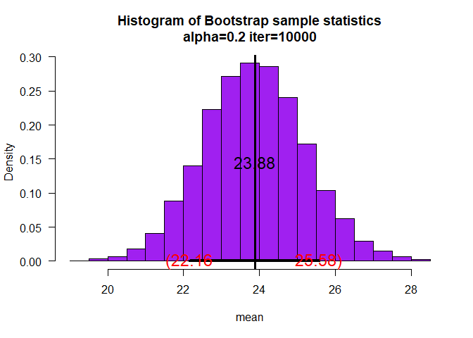<!-- -->

```
## $ci
##      10%      90% 
## 22.16307 25.57561 
## 
## $fun
## [1] "mean"
## 
## $x
##  [1] 23.14434 12.70757 20.72797 19.04018 29.67324 29.21639 14.78348
##  [8] 18.77523 33.37002 34.61627 26.04230 24.40206 32.03731 17.45030
## [15] 19.54464 20.45388 23.83394 30.47815 25.79640 22.67536 10.27711
## [22] 26.77487 37.10044 21.59809 22.50625
```

```r
# B
set.seed(30); sam=rchisq(20,df=3)
myboot2(10000,x=sam,fun="mean",alpha=0.2,xlab="mean",col="Purple",cx=1.5)
```

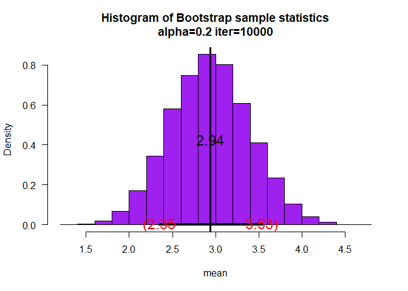<!-- -->

```
## $ci
##      10%      90% 
## 2.349102 3.534979 
## 
## $fun
## [1] "mean"
## 
## $x
##  [1] 0.2531032 1.6194423 5.3578133 7.3134789 0.1194100 5.0344239 5.8189991
##  [8] 4.3689673 1.6690814 3.2533362 0.9050305 2.5730754 1.9610329 2.9675027
## [15] 1.5722396 1.6959031 1.9261106 3.9198072 6.0919801 0.4082447
```

```r
# C
set.seed(40); sam=rgamma(30,shape=2,scale=3)
myboot2(10000,x=sam,fun="mean",alpha=0.2,xlab="mean",col="Purple",cx=1.5)
```

<!-- -->

```
## $ci
##      10%      90% 
## 5.551564 7.442015 
## 
## $fun
## [1] "mean"
## 
## $x
##  [1]  6.4265012  6.5077401  1.8958495  5.3836641  1.4179366  0.7925928
##  [7]  8.0380097 14.7293204  5.2917468  2.7989621  7.9632983  2.8733832
## [13]  7.4419824  2.2828464  5.9877646 12.9354365  1.4996069  1.7478044
## [19] 12.3674161  8.4093535 10.2053201  8.0243948  6.5178039  7.9118846
## [25]  1.6924333 10.7938057  5.7341134 15.1533278  3.8545321  8.1861897
```

```r
# D
set.seed(10); sam=rbeta(20,shape1=3,shape2=4)
myboot2(10000,x=sam,fun="mean",alpha=0.2,xlab="mean",col="Purple",cx=1.5)
```

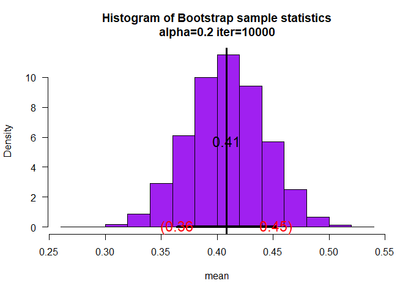<!-- -->

```
## $ci
##       10%       90% 
## 0.3642415 0.4526176 
## 
## $fun
## [1] "mean"
## 
## $x
##  [1] 0.4325491 0.3899825 0.1714409 0.3068918 0.4920588 0.5129946 0.1974398
##  [8] 0.3533577 0.1343329 0.3751208 0.6722481 0.5946901 0.3788602 0.6467397
## [15] 0.5914547 0.4476104 0.2407876 0.3877302 0.5336340 0.3074436
```

#TASK 4
##A)

```r
myboot3<-function(iter=10000,x,fun="mean",alpha=0.05,cx=1.5,...){  #Notice where the ... is repeated in the code
  n=length(x)   #sample size
  
  y=sample(x,n*iter,replace=TRUE)
  rs.mat=matrix(y,nr=n,nc=iter,byrow=TRUE)
  xstat=apply(rs.mat,2,fun) # xstat is a vector and will have iter values in it 
  ci=quantile(xstat,c(alpha/2,1-alpha/2))# Nice way to form a confidence interval
  # A histogram follows
  # The object para will contain the parameters used to make the histogram
  para=hist(xstat,freq=FALSE,las=1,
            main=paste("Histogram of Bootstrap sample statistics","\n","alpha=",alpha," iter=",iter,sep=""),
            ...)
  
  #mat will be a matrix that contains the data, this is done so that I can use apply()
  mat=matrix(x,nr=length(x),nc=1,byrow=TRUE)
  
  #pte is the point estimate
  #This uses whatever fun is
  pte=apply(mat,2,fun)
  abline(v=pte,lwd=3,col="Black")# Vertical line
  segments(ci[1],0,ci[2],0,lwd=4)      #Make the segment for the ci
  text(ci[1],0,paste("(",round(ci[1],2),sep=""),col="Red",cex=cx)
  text(ci[2],0,paste(round(ci[2],2),")",sep=""),col="Red",cex=cx)
  
  # plot the point estimate 1/2 way up the density
  text(pte,max(para$density)/2,round(pte,2),cex=cx)
  
  return(list(ci=ci,fun=fun,x=x,xstat=xstat))# Some output to use if necessary
}

sam=c(1,1,1,2,2,2,2,3,3,3,4,4)
myb3 = myboot3(10000,x=sam,fun="median",alpha=0.2,xlab="mean",col="Purple",cx=1.5)
```

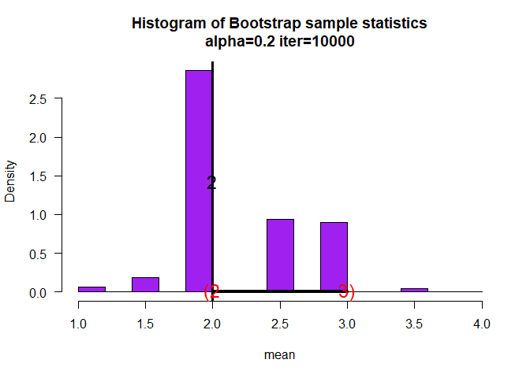<!-- -->

```r
tab = table(myb3$xstat)
barplot(tab, beside = TRUE, col = rainbow(7), main = "Barplot of xstat", xlab = "median",ylab = "Frequency")
```

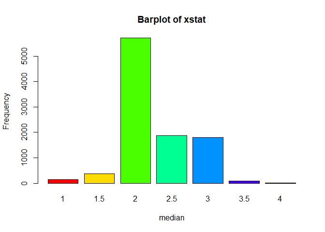<!-- -->

##B) 
The Bootstrap interval estimate  for the median is (2,3).

#TASK 5

##

```r
# 95% estimate, alpha = 0.05 for fun =mean/median
myboot2<-function(iter=10000,x,fun="mean",alpha=0.05,cx=1.5,...){  #Notice where the ... is repeated in the code
  n=length(x)   #sample size
  
  y=sample(x,n*iter,replace=TRUE)
  rs.mat=matrix(y,nr=n,nc=iter,byrow=TRUE)
  xstat=apply(rs.mat,2,fun) # xstat is a vector and will have iter values in it 
  ci=quantile(xstat,c(alpha/2,1-alpha/2))# Nice way to form a confidence interval
  # A histogram follows
  # The object para will contain the parameters used to make the histogram
  para=hist(xstat,freq=FALSE,las=1,
            main=paste("Histogram of Bootstrap sample statistics","\n","alpha=",alpha," iter=",iter,sep=""),
            ...)
  
  #mat will be a matrix that contains the data, this is done so that I can use apply()
  mat=matrix(x,nr=length(x),nc=1,byrow=TRUE)
  
  #pte is the point estimate
  #This uses whatever fun is
  pte=apply(mat,2,fun)
  abline(v=pte,lwd=3,col="Black")# Vertical line
  segments(ci[1],0,ci[2],0,lwd=4)      #Make the segment for the ci
  text(ci[1],0,paste("(",round(ci[1],2),sep=""),col="Red",cex=cx)
  text(ci[2],0,paste(round(ci[2],2),")",sep=""),col="Red",cex=cx)
  
  # plot the point estimate 1/2 way up the density
  text(pte,max(para$density)/2,round(pte,2),cex=cx)
  
  return(list(ci=ci,fun=fun,x=x))# Some output to use if necessary
}
# A
set.seed(39); sam=rnorm(25,mean=25,sd=10)
myboot2(10000,x=sam,fun=function(x) mean(x)/median(x),alpha=0.05,xlab="mean(x)/median(x)",col="Purple",cx=1.5)
```

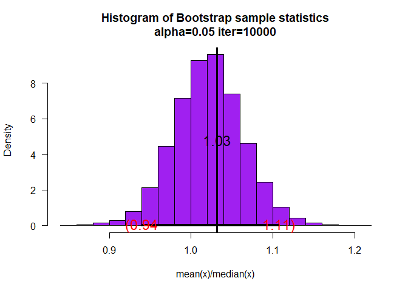<!-- -->

```
## $ci
##      2.5%     97.5% 
## 0.9393388 1.1076165 
## 
## $fun
## function (x) 
## mean(x)/median(x)
## <bytecode: 0x000000001cf76150>
## 
## $x
##  [1] 23.14434 12.70757 20.72797 19.04018 29.67324 29.21639 14.78348
##  [8] 18.77523 33.37002 34.61627 26.04230 24.40206 32.03731 17.45030
## [15] 19.54464 20.45388 23.83394 30.47815 25.79640 22.67536 10.27711
## [22] 26.77487 37.10044 21.59809 22.50625
```

```r
# B
set.seed(30); sam=rchisq(20,df=3)
myboot2(10000,x=sam,fun=function(x) mean(x)/median(x),alpha=0.05,xlab="mean(x)/median(x)",col="Purple",cx=1.5)
```

<!-- -->

```
## $ci
##      2.5%     97.5% 
## 0.8805673 1.6513369 
## 
## $fun
## function (x) 
## mean(x)/median(x)
## <bytecode: 0x00000000190bb158>
## 
## $x
##  [1] 0.2531032 1.6194423 5.3578133 7.3134789 0.1194100 5.0344239 5.8189991
##  [8] 4.3689673 1.6690814 3.2533362 0.9050305 2.5730754 1.9610329 2.9675027
## [15] 1.5722396 1.6959031 1.9261106 3.9198072 6.0919801 0.4082447
```

```r
# C 
set.seed(40); sam=rgamma(30,shape=2,scale=3)
myboot2(10000,x=sam,fun=function(x) mean(x)/median(x),alpha=0.05,xlab="mean(x)/median(x)",col="Purple",cx=1.5)
```

<!-- -->

```
## $ci
##      2.5%     97.5% 
## 0.8705138 1.2395642 
## 
## $fun
## function (x) 
## mean(x)/median(x)
## <bytecode: 0x000000001a3eb5d0>
## 
## $x
##  [1]  6.4265012  6.5077401  1.8958495  5.3836641  1.4179366  0.7925928
##  [7]  8.0380097 14.7293204  5.2917468  2.7989621  7.9632983  2.8733832
## [13]  7.4419824  2.2828464  5.9877646 12.9354365  1.4996069  1.7478044
## [19] 12.3674161  8.4093535 10.2053201  8.0243948  6.5178039  7.9118846
## [25]  1.6924333 10.7938057  5.7341134 15.1533278  3.8545321  8.1861897
```

```r
# D 
set.seed(10); sam=rbeta(20,shape1=3,shape2=4)
myboot2(10000,x=sam,fun=function(x) mean(x)/median(x),alpha=0.05,xlab="mean(x)/median(x)",col="Purple",cx=1.5)
```

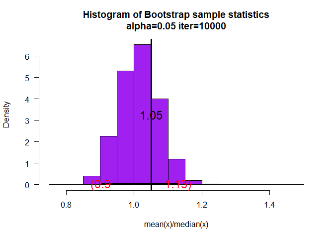<!-- -->

```
## $ci
##      2.5%     97.5% 
## 0.9031685 1.1301854 
## 
## $fun
## function (x) 
## mean(x)/median(x)
## <bytecode: 0x000000001a21b2e0>
## 
## $x
##  [1] 0.4325491 0.3899825 0.1714409 0.3068918 0.4920588 0.5129946 0.1974398
##  [8] 0.3533577 0.1343329 0.3751208 0.6722481 0.5946901 0.3788602 0.6467397
## [15] 0.5914547 0.4476104 0.2407876 0.3877302 0.5336340 0.3074436
```

## 70% INTERVAL

```r
# For 70% intervals
# A
set.seed(39); sam=rnorm(25,mean=25,sd=10)
myboot2(10000,x=sam,fun=function(x) mean(x)/median(x),alpha=0.3,xlab="mean(x)/median(x)",col="Purple",cx=1.5)
```

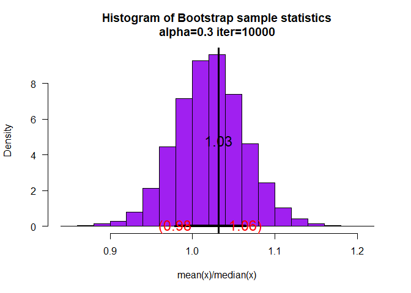<!-- -->

```
## $ci
##       15%       85% 
## 0.9787053 1.0642767 
## 
## $fun
## function (x) 
## mean(x)/median(x)
## <bytecode: 0x000000001c85e8a8>
## 
## $x
##  [1] 23.14434 12.70757 20.72797 19.04018 29.67324 29.21639 14.78348
##  [8] 18.77523 33.37002 34.61627 26.04230 24.40206 32.03731 17.45030
## [15] 19.54464 20.45388 23.83394 30.47815 25.79640 22.67536 10.27711
## [22] 26.77487 37.10044 21.59809 22.50625
```

```r
# B
set.seed(30); sam=rchisq(20,df=3)
myboot2(10000,x=sam,fun=function(x) mean(x)/median(x),alpha=0.3,xlab="mean(x)/median(x)",col="Purple",cx=1.5)
```

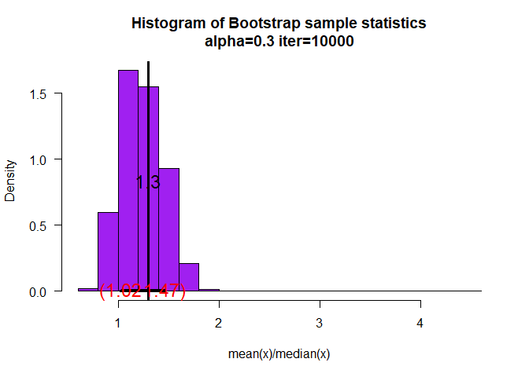<!-- -->

```
## $ci
##      15%      85% 
## 1.020315 1.465416 
## 
## $fun
## function (x) 
## mean(x)/median(x)
## <bytecode: 0x0000000019993438>
## 
## $x
##  [1] 0.2531032 1.6194423 5.3578133 7.3134789 0.1194100 5.0344239 5.8189991
##  [8] 4.3689673 1.6690814 3.2533362 0.9050305 2.5730754 1.9610329 2.9675027
## [15] 1.5722396 1.6959031 1.9261106 3.9198072 6.0919801 0.4082447
```

```r
# C 
set.seed(40); sam=rgamma(30,shape=2,scale=3)
myboot2(10000,x=sam,fun=function(x) mean(x)/median(x),alpha=0.3,xlab="mean(x)/median(x)",col="Purple",cx=1.5)
```

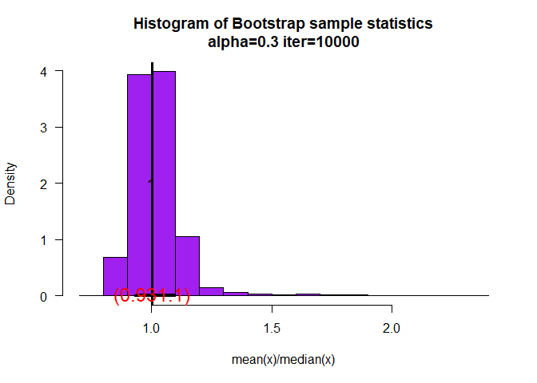<!-- -->

```
## $ci
##       15%       85% 
## 0.9319279 1.0960193 
## 
## $fun
## function (x) 
## mean(x)/median(x)
## <bytecode: 0x00000000181e53d0>
## 
## $x
##  [1]  6.4265012  6.5077401  1.8958495  5.3836641  1.4179366  0.7925928
##  [7]  8.0380097 14.7293204  5.2917468  2.7989621  7.9632983  2.8733832
## [13]  7.4419824  2.2828464  5.9877646 12.9354365  1.4996069  1.7478044
## [19] 12.3674161  8.4093535 10.2053201  8.0243948  6.5178039  7.9118846
## [25]  1.6924333 10.7938057  5.7341134 15.1533278  3.8545321  8.1861897
```

```r
# D 
set.seed(10); sam=rbeta(20,shape1=3,shape2=4)
myboot2(10000,x=sam,fun=function(x) mean(x)/median(x),alpha=0.3,xlab="mean(x)/median(x)",col="Purple",cx=1.5)
```

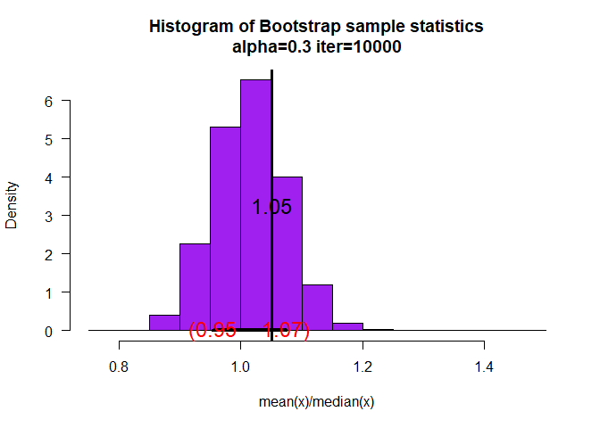<!-- -->

```
## $ci
##       15%       85% 
## 0.9541615 1.0741001 
## 
## $fun
## function (x) 
## mean(x)/median(x)
## <bytecode: 0x000000001c40ed40>
## 
## $x
##  [1] 0.4325491 0.3899825 0.1714409 0.3068918 0.4920588 0.5129946 0.1974398
##  [8] 0.3533577 0.1343329 0.3751208 0.6722481 0.5946901 0.3788602 0.6467397
## [15] 0.5914547 0.4476104 0.2407876 0.3877302 0.5336340 0.3074436
```

#TASK 6
##

```r
? distributions
```

```
## starting httpd help server ... done
```

##

```r
# Uniform, Weibull, Exponential
# Generate samples of size 20
# Uniform
set.seed(39); sam=runif(20,min = 0,max = 3)
unique(sample(sam,20,replace=FALSE) )
```

```
##  [1] 1.9900672 2.9478702 2.0395974 2.3201388 0.4604184 0.7455059 0.2391225
##  [8] 0.6190214 1.0039898 1.2791780 0.8004424 2.4956445 1.2574241 1.0038473
## [15] 0.8267810 0.7865027 0.3284713 2.3961126 1.4014490 1.7882035
```

```r
# Weibull
set.seed(30); sam=rweibull(20,shape = 2, scale = 3)
unique(sample(sam,20,replace=FALSE) )
```

```
##  [1] 2.7918180 2.8824640 4.5643712 4.1493496 3.2873804 0.8609313 0.9810743
##  [8] 2.7509091 4.1984141 3.5247951 1.0743713 3.0157096 2.3407922 3.6728123
## [15] 2.5402136 3.6718959 1.2930345 4.9549259 2.1156310 0.5582696
```

```r
# Exponential
set.seed(40);sam=rexp(20,rate = 2)
unique(sample(sam,20,replace=FALSE) )
```

```
##  [1] 0.59434973 0.45126611 0.04018038 0.61970649 0.17461543 0.13825217
##  [7] 0.19271777 0.46918665 0.41711353 0.96870789 0.25820274 0.97318365
## [13] 0.03302497 1.30896830 1.23787732 0.18358202 1.16042216 0.34125595
## [19] 0.75833968 0.20287391
```

```r
# Binomial
set.seed(10); sam=rbinom(20,40,0.6)
sam
```

```
##  [1] 24 26 25 22 28 26 26 26 23 25 23 24 28 23 25 25 29 26 25 21
```

##

```r
# 80% ci
# Uniform
sam=runif(20,min = 0,max = 3)
myboot2(10000,x=sam,fun=function(x) mean(x),alpha=0.2,xlab="mean(x)",col="Purple",cx=1.5)
```

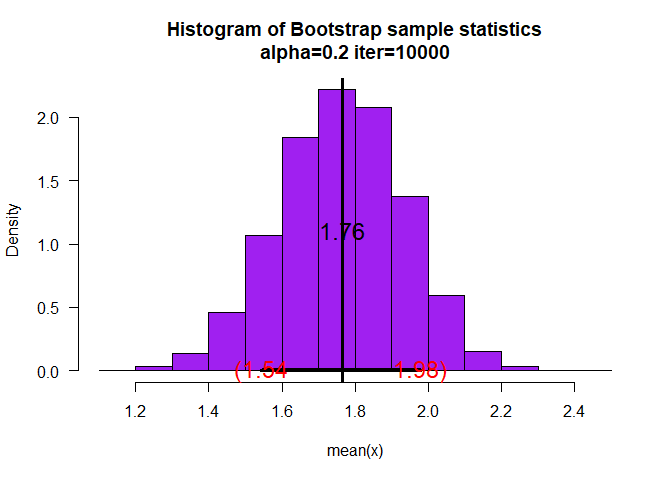<!-- -->

```
## $ci
##      10%      90% 
## 1.543237 1.978453 
## 
## $fun
## function (x) 
## mean(x)
## <bytecode: 0x000000001cc4fb50>
## 
## $x
##  [1] 2.5941637 1.8460573 2.3253297 1.0667061 1.2175499 2.1199407 2.5148630
##  [8] 0.7187674 2.3123146 1.0676932 1.6067911 0.2792644 0.5094091 2.6994974
## [15] 1.2679128 2.2432394 2.4679577 2.8639609 2.0563335 1.5015097
```

```r
myboot2(10000,x=sam,fun=function(x) var(x),alpha=0.2,xlab="var(x)",col="Green",cx=1.5)
```

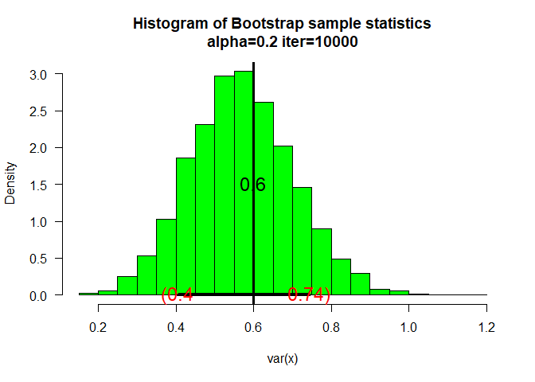<!-- -->

```
## $ci
##       10%       90% 
## 0.4040153 0.7430457 
## 
## $fun
## function (x) 
## var(x)
## <bytecode: 0x000000001db7ed88>
## 
## $x
##  [1] 2.5941637 1.8460573 2.3253297 1.0667061 1.2175499 2.1199407 2.5148630
##  [8] 0.7187674 2.3123146 1.0676932 1.6067911 0.2792644 0.5094091 2.6994974
## [15] 1.2679128 2.2432394 2.4679577 2.8639609 2.0563335 1.5015097
```

```r
# Weibull
sam=rweibull(20,shape = 2, scale = 3)
myboot2(10000,x=sam,fun=function(x) mean(x),alpha=0.2,xlab="mean(x)",col="Purple",cx=1.5)
```

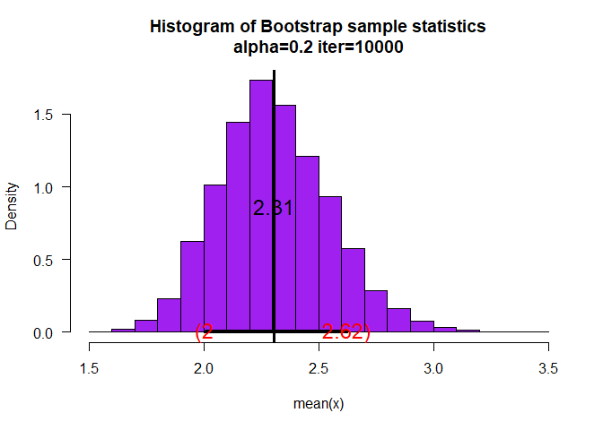<!-- -->

```
## $ci
##      10%      90% 
## 2.004925 2.621395 
## 
## $fun
## function (x) 
## mean(x)
## <bytecode: 0x000000001ccca3c0>
## 
## $x
##  [1] 3.2434001 2.4465682 0.3612573 2.6648465 3.0385561 2.5350260 1.7695396
##  [8] 1.1955023 3.3845106 2.5722189 2.0138379 2.9568655 1.9231088 1.5180690
## [15] 1.1486094 2.3898878 1.1139390 5.6682225 2.0796510 2.0934641
```

```r
myboot2(10000,x=sam,fun=function(x) var(x),alpha=0.2,xlab="var(x)",col="Green",cx=1.5)
```

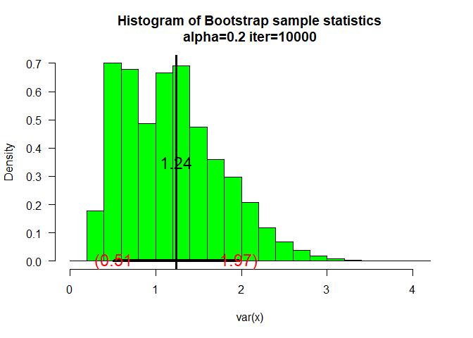<!-- -->

```
## $ci
##       10%       90% 
## 0.5091982 1.9700109 
## 
## $fun
## function (x) 
## var(x)
## <bytecode: 0x000000001cc1c870>
## 
## $x
##  [1] 3.2434001 2.4465682 0.3612573 2.6648465 3.0385561 2.5350260 1.7695396
##  [8] 1.1955023 3.3845106 2.5722189 2.0138379 2.9568655 1.9231088 1.5180690
## [15] 1.1486094 2.3898878 1.1139390 5.6682225 2.0796510 2.0934641
```

```r
# Exponential
sam=rexp(20,rate = 2)
myboot2(10000,x=sam,fun=function(x) mean(x),alpha=0.2,xlab="mean(x)",col="Purple",cx=1.5)
```

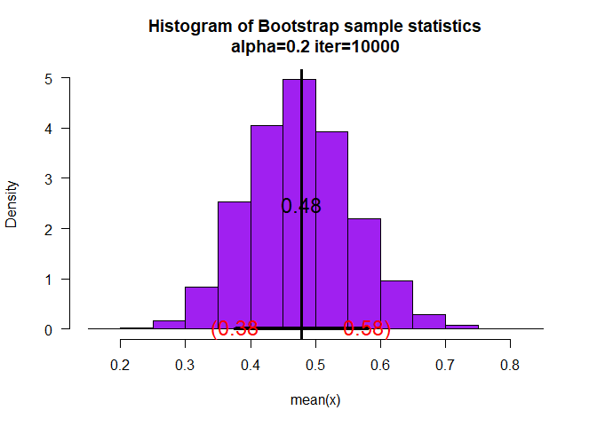<!-- -->

```
## $ci
##       10%       90% 
## 0.3755513 0.5795047 
## 
## $fun
## function (x) 
## mean(x)
## <bytecode: 0x000000001c661f20>
## 
## $x
##  [1] 1.18172313 0.48434013 0.33012502 0.08154989 0.45372150 0.77465192
##  [7] 0.64839148 1.13564560 0.73909450 0.50945106 0.20968391 0.17096272
## [13] 0.06305404 0.40787946 0.18959851 0.24200418 0.19782601 0.53473517
## [19] 0.02677886 1.17617920
```

```r
myboot2(10000,x=sam,fun=function(x) var(x),alpha=0.2,xlab="var(x)",col="Green",cx=1.5)
```

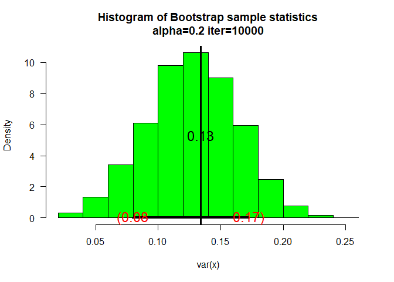<!-- -->

```
## $ci
##        10%        90% 
## 0.07982854 0.17270020 
## 
## $fun
## function (x) 
## var(x)
## <bytecode: 0x000000001e5de818>
## 
## $x
##  [1] 1.18172313 0.48434013 0.33012502 0.08154989 0.45372150 0.77465192
##  [7] 0.64839148 1.13564560 0.73909450 0.50945106 0.20968391 0.17096272
## [13] 0.06305404 0.40787946 0.18959851 0.24200418 0.19782601 0.53473517
## [19] 0.02677886 1.17617920
```

```r
# Binomial
sam=rbinom(20,40,0.6)
myboot2(10000,x=sam,fun=function(x) mean(x),alpha=0.2,xlab="mean(x)",col="Purple",cx=1.5)
```

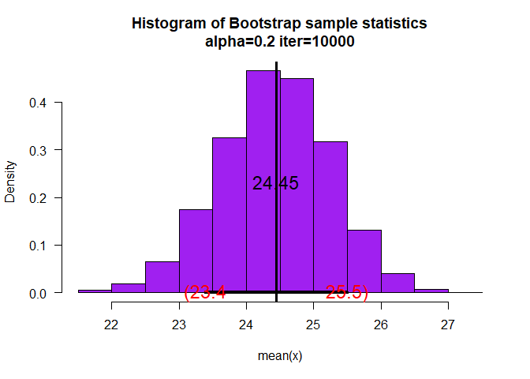<!-- -->

```
## $ci
##    10%    90% 
## 23.395 25.500 
## 
## $fun
## function (x) 
## mean(x)
## <bytecode: 0x000000001d124680>
## 
## $x
##  [1] 25 22 21 22 26 14 33 24 23 22 26 26 28 29 25 26 26 23 26 22
```

```r
myboot2(10000,x=sam,fun=function(x) var(x),alpha=0.2,xlab="var(x)",col="Green",cx=1.5)
```

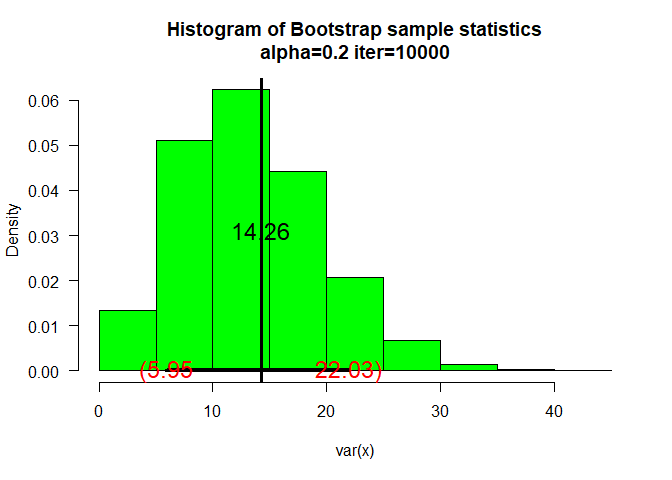<!-- -->

```
## $ci
##       10%       90% 
##  5.947105 22.030263 
## 
## $fun
## function (x) 
## var(x)
## <bytecode: 0x00000000190047c0>
## 
## $x
##  [1] 25 22 21 22 26 14 33 24 23 22 26 26 28 29 25 26 26 23 26 22
```

#TASK 7

```r
# first stat mean(x)/sd(x)
set.seed(68); sam=rnorm(20,mean=10,sd=4)
myboot2(10000,x=sam,fun=function(x) mean(x)/sd(x),alpha=0.2,xlab="(mean(x))/sd(x)",col="Purple",cx=1.5)
```

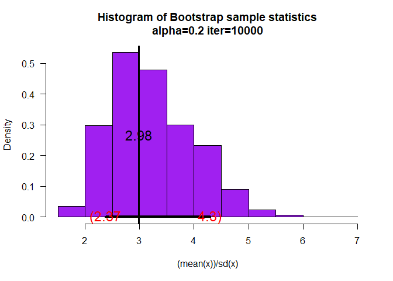<!-- -->

```
## $ci
##      10%      90% 
## 2.372002 4.300261 
## 
## $fun
## function (x) 
## mean(x)/sd(x)
## <bytecode: 0x0000000017d48500>
## 
## $x
##  [1] 15.743750  9.011543  8.487107 12.302301  8.274762 10.033130 14.601905
##  [8] 11.648501 13.546594 13.330691  9.641557  6.760229  6.716014 13.997038
## [15]  9.458889 10.143532  1.155378 11.836486  7.832403 14.664414
```

```r
# 2nd stat IQR(x)
myboot2(10000,x=sam,fun=function(x) IQR(x),alpha=0.2,xlab="IQR(x)",col="Purple",cx=1.5)
```

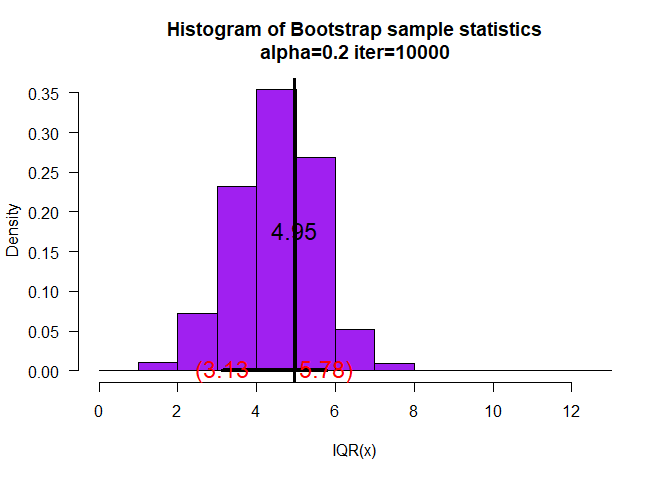<!-- -->

```
## $ci
##      10%      90% 
## 3.130095 5.783980 
## 
## $fun
## function (x) 
## IQR(x)
## <bytecode: 0x000000001c3c8710>
## 
## $x
##  [1] 15.743750  9.011543  8.487107 12.302301  8.274762 10.033130 14.601905
##  [8] 11.648501 13.546594 13.330691  9.641557  6.760229  6.716014 13.997038
## [15]  9.458889 10.143532  1.155378 11.836486  7.832403 14.664414
```

```r
set.seed(68); sam=rnorm(20,mean=10,sd=4)

xstat=sam# xstat is a vector and will have iter values in it 
alpha = 0.05;
ci=quantile(xstat,c(alpha/2,1-alpha/2))


set.seed(68); sam=rnorm(20,mean=10,sd=4)
mu_sam = mean(sam)
mu_sam
```

```
## [1] 10.45931
```

```r
sd_sam = sd(sam)
sd_sam
```

```
## [1] 3.506658
```

```r
qnorm(1-0.05/2,mean=mu_sam,sd=sd_sam)
```

```
## [1] 17.33224
```

```r
qnorm(0.05/2, mean =mu_sam, sd =sd_sam)
```

```
## [1] 3.586387
```

```r
myboot2(10000,x=sam,fun=function(x) mean(x),alpha=0.05,xlab="mean(x)",col="Purple",cx=1.5)
```

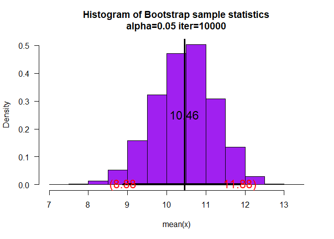<!-- -->

```
## $ci
##     2.5%    97.5% 
##  8.88394 11.87990 
## 
## $fun
## function (x) 
## mean(x)
## <bytecode: 0x000000001a1efff0>
## 
## $x
##  [1] 15.743750  9.011543  8.487107 12.302301  8.274762 10.033130 14.601905
##  [8] 11.648501 13.546594 13.330691  9.641557  6.760229  6.716014 13.997038
## [15]  9.458889 10.143532  1.155378 11.836486  7.832403 14.664414
```


